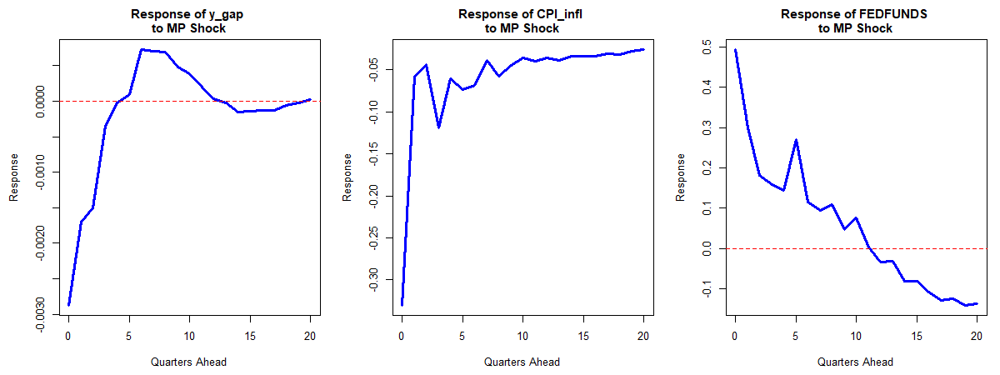

# Replication: Sign Restrictions in SVAR (Fry and Pagan, 2011)

[Language: [Japanese](#japanese) / [English](#english)]

---

## 🇯🇵 日本語での説明

### 1．概要
本プロジェクトは，Fry and Pagan (2011) の手法に基づき，符号制約（Sign Restrictions）を用いた構造ベクトル自己回帰（SVAR）モデルをR言語で実装したものである．特に，従来の符号制約法が抱えていた論理的一貫性の欠如を解決する **Median Target (MT) 法** を採用し，実証分析の妥当性を高めている．

### 2．背景と目的：なぜ「MT法」が必要なのか
経済学において，ある政策（利上げなど）が景気に与える影響を分析する際，SVARモデルが広く用いられる．しかし，データから得られる「誘導型残差」は互いに相関しており，そのままでは純粋な「政策ショック」として分離できない．

* **符号制約法とは**：
    「利上げをすればインフレ率は下がるはずだ」という理論的な「符号（プラス・マイナス）」を条件として課し，条件に合致するモデルを数千回のシミュレーションから抽出する手法である．
* **"the median of the impulse responses" の問題点**：
    従来は，合格した全モデルのインパルス応答の「時点別中央値（median of the impulse responses）」をつなぎ合わせてグラフを作成していた．しかし，Fry and Pagan (2011) は，「各時点の中央値を集めて作ったグラフは，実在するどのモデルとも一致せず，統計的な整合性が保たれない（ショックの直交性が失われる）」と指摘した．
* **MT法の解決策**：
    合格したモデル群の中から，計算された中央値に最も近い「実在する単一のモデル」を一つだけ選出する．これにより，論理的に矛盾のないインパルス応答分析が可能となる．

### 3．モデルとデータ
#### 3.1 モデル定式化
$$z_t = A_1 z_{t-1} + \dots + A_6 z_{t-6} + e_t$$
$$e_t = B \epsilon_t, \quad E[\epsilon_t \epsilon_t'] = I$$

**記号の説明**
* $z_t$：内生変数のベクトル ($y_{gap}, CPI_{infl}, FEDFUNDS$)．
* $A_p$：誘導型モデルの係数行列．本再現では最新データに適合させるため，AICに基づき $p=6$ を採用している．
* $e_t$：観測可能な「誤差」のベクトル． $e_t \sim N(0, \Omega)$ と仮定する．
* $B$：構造ショックが各変数に与える「初動」を規定する識別行列．
* $\epsilon_t$：互いに独立な「構造ショック」のベクトル（例：金融政策ショック）．

#### 3.2 データの前処理
* **年率換算（Annualization）**：
    インフレ率は四半期対数差分を 400 倍し，政策金利と同じ「年率（％）」のスケールに統一した．これにより推定の安定性と解釈の容易性を確保している．
* **フィルタリング**：
    GDPからトレンドを除去し，景気循環成分（産出量ギャップ）を抽出するために HPフィルター（$\lambda=1600$）を適用した．

### 4．分析結果
シミュレーションの結果，5,000回の試行のうち 498 個のモデルが符号制約をパスした．MT法によって選出された代表モデルのインパルス応答（下図）は，金融引き締めショック（MPショック）によって産出量とインフレ率がなめらかに抑制される様子を示しており，マクロ経済理論と整合的である．

---

## 🇺🇸 English Description

### 1. Overview
This project provides a robust R implementation of the **Median Target (MT) method** for Structural VAR (SVAR) models, as proposed by Fry and Pagan (2011). It identifies structural shocks using sign restrictions while ensuring the logical consistency of the resulting impulse response functions (IRFs).

### 2. Theoretical Motivation: Why MT Method?
In the context of SVAR identification via sign restrictions, researchers often report the **"median of the impulse responses"** across all accepted models. Fry and Pagan (2011) demonstrated that such a median response:
1. Does not correspond to any single underlying structural model.
2. Fails to satisfy the orthogonality condition of structural shocks.

The **MT Method** addresses these issues by selecting the single "best" model from the set of accepted candidates—specifically, the one closest to the calculated medians across all horizons.

### 3. Model and Data
#### 3.1 Specification
We estimate a 3-variable VAR with $p=6$ lags, selected via AIC to capture long-term dynamics in the extended FRED dataset.

* **Endogenous Variables ($z_t$)**: Output Gap ($y_{gap}$), Annualized Inflation ($CPI_{infl}$), and Federal Funds Rate ($FEDFUNDS$).
* **Annualization**: Inflation is calculated as 400 times the log-difference of the CPI to match the annualized scale of the interest rate.

#### 3.2 Identification Strategy
We identify a **Monetary Policy (MP) Shock** using the following sign restrictions on the impact matrix $B$:
* **FEDFUNDS**: $+$ (Rise in interest rates)
* **Output Gap**: $-$ (Decline in economic activity)
* **Inflation**: $-$ (Decline in price levels)

### 4. Key Results
The system satisfies stability conditions (all roots $< 1$). The selected MT model generates smooth and economically intuitive IRFs, where a contractionary MP shock leads to a persistent decrease in both output and inflation over 20 quarters.